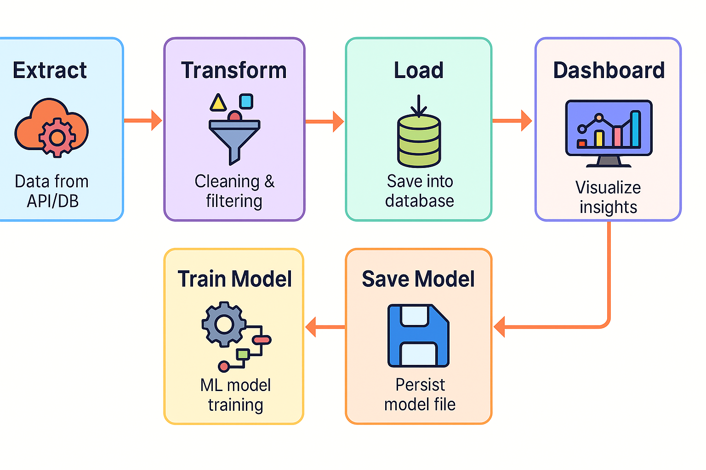

# ✈️ Flight ETL & Dashboard Project

## 📁 Project Folder Structure

```
flight_etl_project/
├── main.py
├── app.py
├── extract.py
├── transform.py
├── load.py
├── requirements.txt
├── README.md
├── .env
├── flight_delay_model.pkl
├── dashboard/
│   └── dashboard.py
├── images/
│   └── ...
└── venv/
    └── ...
```

## 🔄 ETL Pipeline Flow
  
<!-- Replace the above path with your actual ETL flow image -->

---

## 📍 Dataset Location
- Database: PostgreSQL  
- Table: `flights`

## 🧼 What It Does
- Extracts flight data from PostgreSQL  
- Transforms and analyzes data  
- Loads data into the database  
- Trains a machine learning model for flight delay prediction  
- Visualizes flight status and top flight routes with interactive charts  

## 🧰 Tools Used
- Python  
- Pandas  
- SQLAlchemy  
- PostgreSQL  
- Streamlit  
- Matplotlib  
- Flask

## ▶️ How to Run

### 1. Setup virtual environment and install dependencies:
```bash
python3 -m venv venv
source venv/bin/activate   # macOS/Linux
pip install -r requirements.txt
```

### 2. Running the Flask Backend
To start the Flask server, run:
```bash
python3 app.py
```

### 3. Running the Streamlit Dashboard
To start the Streamlit app, run:
```bash
streamlit run dashboard/dashboard.py
```

---

## ⏰ Automation with Cron Job

The ETL pipeline is scheduled to run automatically every day at 2 AM using a cron job.

Example cron job entry:

```bash
0 2 * * * /path/to/your/venv/bin/python /path/to/project/main.py >> /path/to/project/cron.log 2>&1
```

- This runs the ETL script daily at 2 AM.  
- Output and errors are logged to `cron.log`.  
- Adjust the paths to your environment.

To edit your cron jobs, run:

```bash
crontab -e
```
